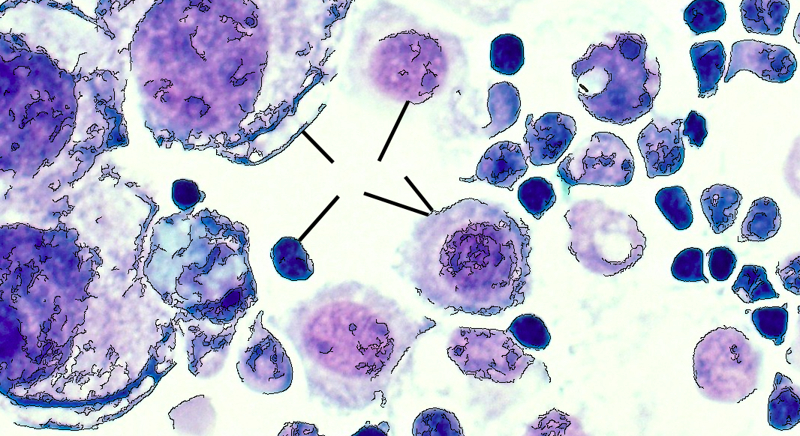

<h1 align="center">caMicroscope evaluation task for GSOC 2021</h1>

**Problem Statement**: Create a page or tool which performs edge detection on a given image and, given a point, returns the distance from that point to the closest edge.

### Implementation:

* Used Canny Edge detection on the uploaded image.
* Displays the original image on canvas and then the original image with the edges darkened.
* On mouse click on any point detects the closest edge and draws a dark line till that point.

### To run the file:
* ```npm install```
* ```npm run dev```

Or
* presence of live server must suffice.

### Result:
